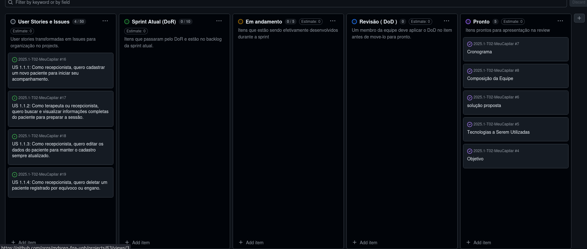
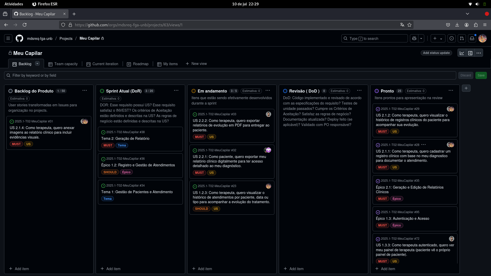

## Comprovação do Uso do GitHub Projects

Esta aba tem como objetivo comprovar que o GitHub Projects foi utilizado devidamente durante o desenvolvimento do trabalho da disciplina. 

Abaixo, seguem alguns estados do mesmo durante o semestre.

### Github Projects dia 18/05 - Estágio Inicial do backlog - Sprint 1/2

### Github Projects dia 10/07 - Após Diversas etapas do desenvolvimento - Sprint 5

