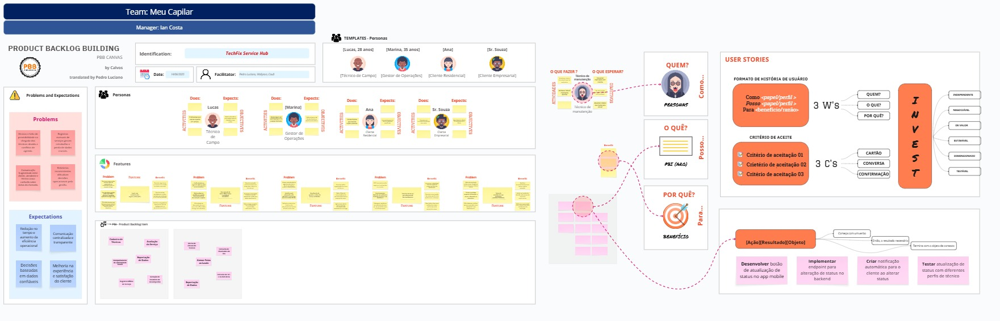

# PRODUCT BACKLOG BUILDING (PBB) – TechFix

## PRODUCT NAME

**TechFix Service Hub** – plataforma web e mobile para gestão de chamados de assistência técnica de equipamentos eletrônicos.

## PROBLEMAS

- Atrasos e falta de previsibilidade na chegada dos técnicos devido a conflitos de agenda.
- Registros manuais de serviços geram retrabalho e perda de dados cruciais.
- Comunicação fragmentada entre cliente, atendente e técnico causa confusão sobre status do chamado.
- Relatórios inconsistentes dificultam decisões operacionais pela gestão.

## EXPECTATIVAS

**Redução no tempo e aumento da eficiência operacional**  
A plataforma deve reduzir em até 30% o tempo médio de atendimento, otimizando a roteirização dos técnicos e eliminando retrabalhos com registros manuais.

**Comunicação centralizada e transparente**  
Ao integrar chat e rastreamento em tempo real, a solução trará mais clareza para clientes e maior coordenação entre suporte e técnicos.

**Decisões baseadas em dados confiáveis**  
Relatórios automáticos e dashboards em tempo real permitirão que gestores acompanhem KPIs com precisão e agilidade.

**Melhoria na experiência e satisfação do cliente**  
Com processos mais rápidos, feedback facilitado e maior previsibilidade, espera-se alcançar um CSAT ≥ 4,5/5.

---

## PERSONAS

| Persona             | Descrição                                      | Necessidade-chave                                               |
|---------------------|-----------------------------------------------|------------------------------------------------------------------|
| Técnico de Campo    | Profissional que realiza reparos em campo.     | Roteiro otimizado e informações claras do chamado no app mobile. |
| Gestor de Operações | Responsável por acompanhar KPIs e alocar técnicos. | Visão em tempo real dos atendimentos e relatórios automáticos. |
| Cliente Empresarial | Empresa que contrata manutenção recorrente.    | Agendamento rápido e transparência no status.                    |
| Cliente Residencial | Consumidora que solicita reparo pontual.       | Acompanhamento do técnico e feedback simplificado.              |

---

## FEATURES (FUNCIONALIDADES DE ALTO NÍVEL)

- Login com autenticação segura (token JWT).

- Sincronização de dados offline/online com fallback automático.

- Visualização de agenda e ordens de serviço atribuídas.

- Check-in/check-out georreferenciado em atendimentos.

- Formulários dinâmicos para coleta de informações técnicas.

- Upload de fotos e evidências da visita técnica.

- Status de atendimento (em andamento, pendente, finalizado).

- Assinatura digital do cliente no encerramento da OS.

---

## BENEFÍCIOS GERADOS PELA SOLUÇÃO TECHFIX

### 1. Redução de atrasos e maior previsibilidade
- Roteirização automática otimiza os deslocamentos.  
- Agenda inteligente evita conflitos e sobreposições.  
- Técnicos chegam no horário e com informações atualizadas.

### 2. Eliminação de retrabalho e perda de dados
- App mobile offline-first assegura registros mesmo sem conexão.  
- Dados digitalizados eliminam o uso de papel e duplicidades.  
- Formulários padronizados reduzem erros de preenchimento.

### 3. Comunicação clara e centralizada
- Chat integrado conecta cliente, suporte e técnico em um só canal.  
- Redução de ruídos e retrabalho por falha de comunicação.  
- Histórico de interações facilita acompanhamento e suporte.

### 4. Gestão orientada por dados em tempo real
- Dashboard atualizado permite decisões baseadas em fatos.  
- Métricas de desempenho ajudam a identificar gargalos.  
- Supervisores acompanham o status das operações em tempo real.

---

## Behavior-Driven Development (BDD) – Critérios de Aceitação

### PBI‑01 – Cadastro de Técnicos (Alta)

**Cenário: Cadastro de Técnicos**  
Dado que o gestor acessa o painel de administração,
Quando ele preenche os dados do técnico (nome: "João Silva", especialidade: "Manutenção de Rede", disponibilidade: "08h às 12h") e confirma o cadastro,
Então o técnico é incluído na escala e aparece na lista de técnicos disponíveis, com as seguintes informações: nome, especialidade e disponibilidade.

**Critérios de Aceitação:**
- O gestor consegue adicionar técnicos com nome, especialidade e horários.

- Técnicos aparecem disponíveis para escala após cadastro.

- O sistema impede cadastro com campos obrigatórios vazios.

- É possível editar ou excluir um técnico cadastrado.

---

### PBI‑02 – Consulta de Chamados do Dia (Alta)

**Cenário: Consulta de Chamados do Dia**  
Dado que o técnico "Carlos Lima" está logado no app mobile,
Quando ele acessa a aba de chamados,
Então são exibidos os atendimentos do dia, incluindo: cliente: "Empresa X", endereço: "Rua das Palmeiras, 123", horário: "09h30", tipo de serviço: "Instalação de Roteador".

**Critérios de Aceitação:**
- O técnico vê todos os chamados do dia organizados por ordem de atendimento.

- Cada chamado exibe cliente, endereço, horário e tipo de serviço.

- Chamados atualizam automaticamente em caso de alteração pelo gestor.

- O técnico pode marcar chamados como "em andamento" ou "concluído".

---

### PBI‑03 – Acompanhamento da Localização do Técnico (Alta)

**Cenário: Acompanhamento da Localização do Técnico**  
Dado que o técnico "Marcos Tavares" iniciou o deslocamento e ativou o check-in às 14h,
Quando o cliente "Ana Souza" acessa o chamado #5421 pelo app,
Então ele vê a localização atual do técnico no mapa, em movimento, com o tempo estimado de chegada: 15 minutos.

**Critérios de Aceitação:**
- O cliente visualiza a posição do técnico no mapa após o check-in.

- O app mostra o tempo estimado de chegada.

- O cliente é notificado se houver atrasos significativos.

- A localização é atualizada periodicamente.

---

### PBI‑04 – Registro Offline de Serviço (Alta)

**Cenário: Registro Offline de Serviço**  
Dado que o técnico "Eduardo Melo" está sem conexão com a internet,
Quando ele realiza o check-in às 10h05 e o check-out às 10h42 pelo app,
Então os dados são armazenados localmente e sincronizados automaticamente quando a conexão for restabelecida, incluindo data, hora e localização de cada ação.

**Critérios de Aceitação:**
- O app permite check-in/out mesmo offline.

- Dados são armazenados localmente até a sincronização com a nuvem.

- O registro inclui data, hora e localização.

- O gestor pode ver os registros assim que sincronizados.

---

### PBI‑05 – Geração de Relatório de Desempenho (Média)

**Cenário: Geração de Relatório de Desempenho**  
Dado que o gestor acessa a área de relatórios,
Quando ele seleciona o técnico "Bruno Costa" e o período de "01 a 30 de junho de 2025",
Então o sistema exibe os dados de desempenho: número de atendimentos (32), tempo médio por atendimento (38 minutos) e média de avaliação (4,6), com opção de exportação em PDF.

**Critérios de Aceitação:**
- O sistema gera relatórios filtrando por técnico e período.

- O relatório inclui número de atendimentos, tempo médio e avaliações.

- É possível exportar o relatório em PDF.

- Dados são atualizados automaticamente a cada novo atendimento registrado.

---

### PBI‑06 – Avaliação do Serviço (Média)

**Cenário: Avaliação do Serviço**  
Dado que o atendimento do chamado #7854 foi finalizado às 16h12,
Quando o cliente "Mariana Lopes" acessa a avaliação pelo link enviado por e-mail,
Então ela pode atribuir uma nota de 4 estrelas e deixar o comentário "Atendimento rápido e educado", que são registrados no sistema com vínculo ao chamado e técnico.

**Critérios de Aceitação:**
- O cliente recebe um convite para avaliar o serviço após a finalização.

- A avaliação inclui nota de 1 a 5 e campo opcional para comentário.

- O sistema registra a avaliação com vínculo ao atendimento e técnico.

- O gestor pode visualizar avaliações no painel.

---

### PBI‑07 – Alerta de Atraso do Técnico (Média)

**Cenário: Alerta de Atraso do Técnico**  
Dado que o técnico "Rafael Dias" tinha atendimento previsto para 11h00 no chamado #9123,
Quando o sistema detecta que o tempo estimado de chegada excedeu 15 minutos (ETA: 11h20),
Então é enviado um alerta automático ao gestor com os seguintes dados: técnico: "Rafael Dias", chamado: #9123, cliente: "Comercial Silva", motivo estimado: "trânsito intenso".

**Critérios de Aceitação:**
- O sistema calcula o tempo previsto de chegada de cada técnico.

- Se houver atraso maior que 15 minutos, o gestor recebe uma notificação.

- O alerta mostra o técnico, chamado e motivo estimado do atraso.

- O gestor pode reagendar ou redistribuir o chamado com base no alerta.

---

### PBI‑08 – Anexar Fotos ao Laudo (Baixa)

**Cenário: Anexar Fotos ao Laudo**  
Dado que o técnico "Daniel Rocha" está finalizando o chamado #6032,
Quando ele acessa a opção de anexar imagens e tira uma foto do equipamento danificado às 13h47,
Então a imagem é anexada ao laudo técnico com carimbo de data/hora e fica disponível no histórico de atendimento.

**Critérios de Aceitação:**
- O técnico pode tirar fotos diretamente do app ou selecionar da galeria.

- As imagens são vinculadas ao chamado e salvas com data/hora.

- É possível anexar até 5 fotos por chamado.

- O gestor pode visualizar as fotos no histórico de atendimento.

---

### PBI‑09 – Exportação de Dados (Baixa)

**Cenário: Exportação de Dados**  
Dado que o gestor deseja analisar atendimentos feitos entre "01 e 10 de julho de 2025",
Quando ele aplica os filtros por período e técnico: "Luciana Prado", e clica em "Exportar CSV",
Então o sistema gera um arquivo com os seguintes dados: ID do chamado, cliente, técnico, data, status, tipo de serviço.

**Critérios de Aceitação:**
- O sistema oferece a opção de exportar dados filtrados por data, técnico e status.

- O arquivo CSV pode ser baixado no painel do gestor.

- As colunas incluem ID do chamado, cliente, técnico, datas e status.

- Os dados são atualizados no momento da exportação.

---

### PBI‑10 – Emissão de NF-e Automática (Baixa)

**Cenário: Emissão de NF-e Automática**  
Dado que o cliente empresarial "LogTech S/A" possui CNPJ: 12.345.678/0001-99 e teve o chamado #7001 concluído às 17h40,
Quando o sistema detecta o encerramento com status "concluído",
Então ele gera automaticamente a NF-e e envia para o e-mail financeiro@logtech.com.br, com registro da emissão vinculado ao sistema da SEFAZ via API.

**Critérios de Aceitação:**
- O sistema gera a NF-e automaticamente após a conclusão do serviço.

- A nota fiscal é enviada para o e-mail cadastrado do cliente.

- O cliente pode consultar o histórico de NF-e emitidas pelo sistema.

- A emissão é integrada a um sistema SEFAZ válido por meio de API.

### US - Users Stories

- **Eu, Gestor,** quero cadastrar técnicos (nome, especialidade, disponibilidade)  
  **para** que possa montar a escala.

- **Eu, Técnico,** quero ver meus chamados do dia no app  
  **para** planejar meu trajeto.

- **Eu, Cliente,** quero acompanhar em tempo real a localização do técnico  
  **para** saber quando ele chegará.

- **Eu, Técnico,** quero registrar início e fim do serviço (check-in/out) mesmo sem internet  
  **para** não perder dados.

- **Eu, Gestor,** quero gerar relatório de desempenho por técnico  
  **para** identificar gargalos.

- **Eu, Cliente,** quero avaliar o serviço após a conclusão  
  **para** fornecer feedback.

- **Eu, Gestor,** quero receber alertas automáticos se um técnico atrasar >15 min  
  **para** agir rapidamente.

- **Eu, Técnico,** quero anexar fotos do equipamento ao laudo  
  **para** comprovar serviço.

- **Eu, Gestor,** quero exportar dados em CSV  
  **para** análises externas.

- **Eu, Cliente Empresarial,** quero emitir NF‑e automaticamente  
  **para** fins contábeis.

### CRITÉRIOS DE PRIORIZAÇÃO – PROJETO TECHFIX

### 1. Valor para o Usuário

| Nota | Descrição                                |
|------|------------------------------------------|
| 5    | Impacto crítico (essencial)              |
| 3    | Importante (melhora muito a experiência) |
| 1    | Desejável (não essencial)                |

### 2. Urgência / Necessidade Imediata

| Nota | Descrição                               |
|------|-----------------------------------------|
| 5    | Bloqueia entregas ou tem prazo definido |
| 3    | Necessária a curto prazo                |
| 1    | Pode esperar sem grandes impactos       |

### 3. Clareza e Prontidão

| Nota | Descrição           |
|------|---------------------|
| 5    | Totalmente clara    |
| 3    | Requer ajustes      |
| 1    | Pouco definida      |

### 4. Esforço Estimado

| Nota | Descrição     |
|------|---------------|
| 1    | Baixo esforço |
| 3    | Médio esforço |
| 5    | Alto esforço  |

### 5. Fórmula de Priorização

**Prioridade = (Valor + Urgência + Clareza) – Esforço**

**Classificação Final:**

- Alta Prioridade: 11 a 15  
- Média Prioridade: 8 a 10  
- Baixa Prioridade: 7 ou menos
