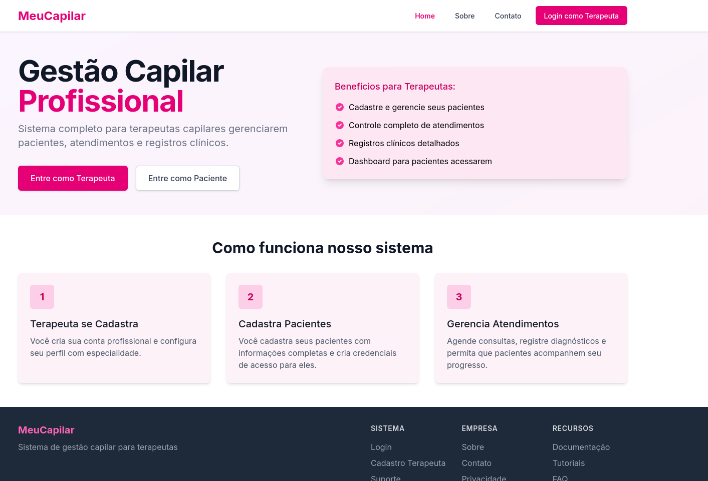
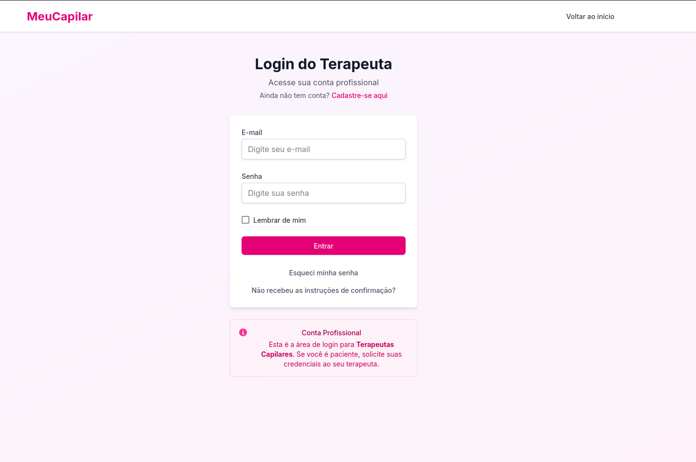
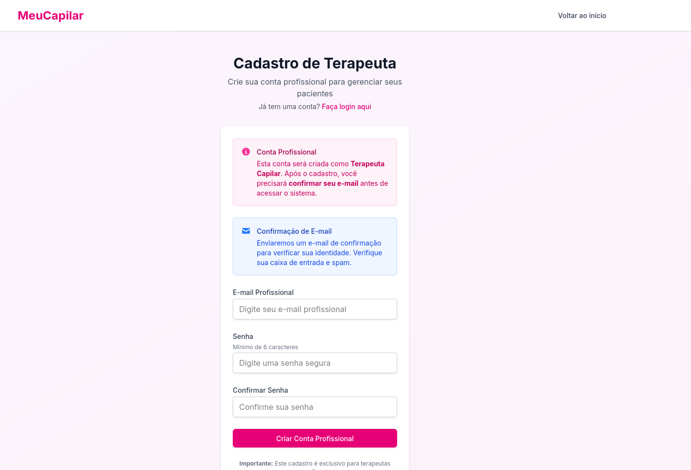

# Acesso ao MeuCapilar
Abaixo segue o tutorial básico para se cadastrar no MeuCapilar e começar a testar as funcionalidades.

Acesse meucapilar.com.br

Clique em "Entre Como Terapeuta"

Clique em "Cadastre-se aqui"

Coloque seu e-mail, senha e confirme o e-mail, assim você terá acesso ao MeuCapilar e pode testar as funcionalides/USs que desejadas!

