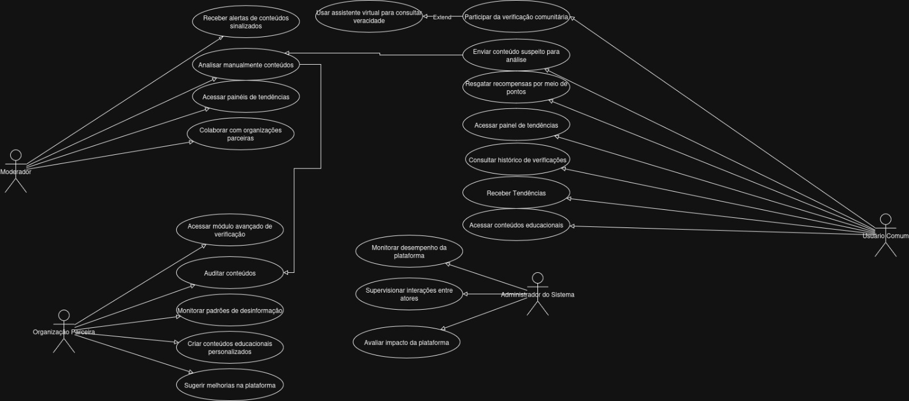

# Casos de Uso - Verify

## Visão Geral

O diagrama abaixo representa os **casos de uso do sistema Verify**, uma plataforma desenvolvida para combater a desinformação utilizando inteligência artificial, colaboração entre usuários, moderação especializada e parcerias estratégicas. A ferramenta foi projetada para atuar em múltiplos contextos — como redes sociais, aplicativos de mensagens e ambientes educacionais — oferecendo suporte para verificação de conteúdos suspeitos, educação digital e análise de padrões de desinformação.

## Atores Envolvidos

- **Usuário Comum**: Pode enviar conteúdos para análise, acessar relatórios, tendências e materiais educativos, além de participar da verificação comunitária.
- **Moderador**: Responsável pela análise manual dos conteúdos sinalizados, colaboração com organizações e gerenciamento de tendências.
- **Organização Parceira**: Atua na auditoria de conteúdos, criação de materiais educativos personalizados e sugestão de melhorias para a plataforma.
- **Administrador do Sistema**: Monitora o desempenho da plataforma, supervisiona interações entre atores e avalia o impacto do sistema.

## Diagrama de Casos de Uso

## Descrição dos Casos de Uso

O diagrama ilustra diversas funcionalidades disponíveis para cada ator. Alguns exemplos:

<ol>
  <li><strong>Usuário comum</strong> pode:
    <ol>
      <li>Participar da verificação comunitária;</li>
      <li>Enviar conteúdo suspeito;</li>
      <li>Consultar histórico de verificações;</li>
      <li>Resgatar recompensas e acessar conteúdos educativos.</li>
    </ol>
  </li>
  <li><strong>Moderador</strong> pode:
    <ol>
      <li>Receber alertas de conteúdos sinalizados;</li>
      <li>Analisar conteúdos manualmente;</li>
      <li>Colaborar com organizações parceiras.</li>
    </ol>
  </li>
  <li><strong>Organização parceira</strong> pode:
    <ol>
      <li>Acessar módulos avançados de verificação;</li>
      <li>Monitorar padrões de desinformação;</li>
      <li>Criar conteúdos personalizados.</li>
    </ol>
  </li>
  <li><strong>Administrador do sistema</strong> pode:
    <ol>
      <li>Avaliar o impacto da plataforma;</li>
      <li>Supervisionar interações e desempenho geral.</li>
    </ol>
  </li>
</ol>

---

Este diagrama e suas funcionalidades reforçam o papel colaborativo e multidisciplinar do Verify, tornando-o uma solução robusta no combate à desinformação digital.
